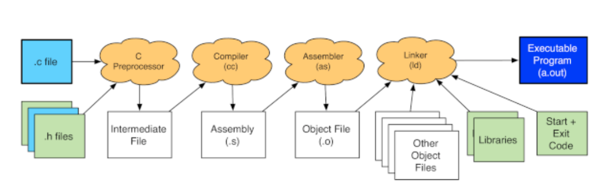

# building c program

```
$ vi hello.c

#include <stdio.h>
#include <stdlib.h>

int main(void) {
    printf("Hello World\n");
    return EXIT_SUCCESS; 
}


$ gcc -Wall -o hello hello.c

$ ./hello
Hello World
```

### compile usinig make
```
$ make
gcc -std=gnu99 -pedantic -Wall -Wsign-compare -Wwrite-strings -Wtype-limits -Werror -c hello.c
gcc -o hello hello.o 
```

### Compilation Process

