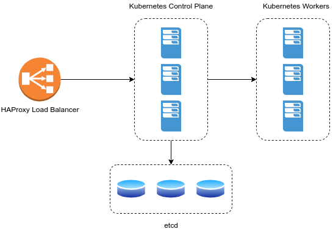

# target architecture



## prerequisites
* virtualbox
* vagrant
* ubuntu desktop 20.04.3

## ubuntu client
```
sudo apt update

sudo apt install build-essential dkms linux-headers-$(uname -r)

```

## setup etcd for all 3 machines
```

{
  wget -q --show-progress "https://github.com/etcd-io/etcd/releases/download/v3.4.10/etcd-v3.4.10-linux-amd64.tar.gz"
  tar zxf etcd-v3.4.10-linux-amd64.tar.gz
  mv etcd-v3.4.10-linux-amd64/etcd* /usr/local/bin/
  rm -rf etcd*
}

```

### create etcd service on etcd1
```
etcdVMIP="172.16.16.201"

etcd1IP="172.16.16.201"
etcd2IP="172.16.16.202"
etcd3IP="172.16.16.203"

cat <<EOF >/etc/systemd/system/etcd.service
[Unit]
Description=etcd

[Service]
Type=notify
ExecStart=/usr/local/bin/etcd \\
  --name $(hostname -s) \\
  --initial-advertise-peer-urls http://${etcdVMIP}:2380 \\
  --listen-peer-urls http://${etcdVMIP}:2380 \\
  --advertise-client-urls http://${etcdVMIP}:2379 \\
  --listen-client-urls http://${etcdVMIP}:2379,http://127.0.0.1:2379 \\
  --initial-cluster-token etcd-cluster-1 \\
  --initial-cluster etcd1=http://${etcd1IP}:2380,etcd2=http://${etcd2IP}:2380,etcd3=http://${etcd3IP}:2380 \\
  --initial-cluster-state new
Restart=on-failure
RestartSec=5

[Install]
WantedBy=multi-user.target
EOF

```

### create etcd service on etcd2 
```
etcdVMIP="172.16.16.202"

etcd1IP="172.16.16.201"
etcd2IP="172.16.16.202"
etcd3IP="172.16.16.203"

cat <<EOF >/etc/systemd/system/etcd.service
[Unit]
Description=etcd

[Service]
Type=notify
ExecStart=/usr/local/bin/etcd \\
  --name $(hostname -s) \\
  --initial-advertise-peer-urls http://${etcdVMIP}:2380 \\
  --listen-peer-urls http://${etcdVMIP}:2380 \\
  --advertise-client-urls http://${etcdVMIP}:2379 \\
  --listen-client-urls http://${etcdVMIP}:2379,http://127.0.0.1:2379 \\
  --initial-cluster-token etcd-cluster-1 \\
  --initial-cluster etcd1=http://${etcd1IP}:2380,etcd2=http://${etcd2IP}:2380,etcd3=http://${etcd3IP}:2380 \\
  --initial-cluster-state new
Restart=on-failure
RestartSec=5

[Install]
WantedBy=multi-user.target
EOF
```

### create etcd service on etcd3
```
etcdVMIP="172.16.16.203"

etcd1IP="172.16.16.201"
etcd2IP="172.16.16.202"
etcd3IP="172.16.16.203"

cat <<EOF >/etc/systemd/system/etcd.service
[Unit]
Description=etcd

[Service]
Type=notify
ExecStart=/usr/local/bin/etcd \\
  --name $(hostname -s) \\
  --initial-advertise-peer-urls http://${etcdVMIP}:2380 \\
  --listen-peer-urls http://${etcdVMIP}:2380 \\
  --advertise-client-urls http://${etcdVMIP}:2379 \\
  --listen-client-urls http://${etcdVMIP}:2379,http://127.0.0.1:2379 \\
  --initial-cluster-token etcd-cluster-1 \\
  --initial-cluster etcd1=http://${etcd1IP}:2380,etcd2=http://${etcd2IP}:2380,etcd3=http://${etcd3IP}:2380 \\
  --initial-cluster-state new
Restart=on-failure
RestartSec=5

[Install]
WantedBy=multi-user.target
EOF
```

### start etcd service on all etcd machines
```
{
  systemctl daemon-reload
  systemctl enable --now etcd
}

```

## HAProxy
```
apt update
apt install haproxy
```
haproxy.cfg
```
frontend lb
    bind 172.16.16.200:6443
    mode tcp
    option tcplog
    default_backend master

backend master
    mode tcp
    option tcp-check
    balance roundrobin
    server master1 172.16.16.211:6443 check fall 3 rise 2
    server master2 172.16.16.212:6443 check fall 3 rise 2
    server master3 172.16.16.213:6443 check fall 3 rise 2
```

```
vi /etc/haproxy/haproxy.cfg

systemctl restart haproxy
```

## k8s masters and workers nodes

Do it for all 3 masters and 3 workers nodes
```
1. disable swap
swapoff -a; sed -i '/swap/d' /etc/fstab

2. install docker engine
{
  apt install -y apt-transport-https ca-certificates curl gnupg-agent software-properties-common
  curl -fsSL https://download.docker.com/linux/ubuntu/gpg | apt-key add -
  add-apt-repository "deb [arch=amd64] https://download.docker.com/linux/ubuntu $(lsb_release -cs) stable"
  apt update
  apt install -y docker-ce=5:19.03.10~3-0~ubuntu-focal containerd.io
}

3. k8s apt repo
{
  curl -s https://packages.cloud.google.com/apt/doc/apt-key.gpg | apt-key add -
  echo "deb https://apt.kubernetes.io/ kubernetes-xenial main" > /etc/apt/sources.list.d/kubernetes.list
}

4. k8s components
apt update && apt install -y kubeadm=1.19.2-00 kubelet=1.19.2-00 kubectl=1.19.2-00
```

## initialize master
```
1. kubeadm config for master1

{
cat <<EOF > kubeadm-config.yaml
apiVersion: kubeadm.k8s.io/v1beta2
kind: ClusterConfiguration
controlPlaneEndpoint: "172.16.16.200:6443"
networking:
  podSubnet: "192.168.0.0/16"
etcd:
    external:
        endpoints:
        - http://172.16.16.201:2379
        - http://172.16.16.202:2379
        - http://172.16.16.203:2379
---
apiVersion: kubeadm.k8s.io/v1beta2
kind: InitConfiguration
localAPIEndpoint:
  advertiseAddress: "172.16.16.200"
EOF
}

2. kubeadm init for master1
kubeadm init --config kubeadm-config.yaml --ignore-preflight-errors=all --upload-certs

copy join commands for master and worker to use it later.

3. get node status
kubectl --kubeconfig=/etc/kubernetes/admin.conf get nodes

4. install calico
kubectl --kubeconfig=/etc/kubernetes/admin.conf create -f https://docs.projectcalico.org/v3.14/manifests/calico.yaml

5. run join command for master2, master3 and 3 worker nodes

6. run command in master1

mkdir -p $HOME/.kube
sudo cp -i /etc/kubernetes/admin.conf $HOME/.kube/config
sudo chown $(id -u):$(id -g) $HOME/.kube/config

7. run the command to get all nodes

root@master1:~# kubectl get nodes
NAME      STATUS   ROLES    AGE     VERSION
master1   Ready    master   9m56s   v1.19.2
master2   Ready    master   3m16s   v1.19.2
master3   Ready    master   3m9s    v1.19.2
worker1   Ready    <none>   2m      v1.19.2
worker2   Ready    <none>   115s    v1.19.2
worker3   Ready    <none>   110s    v1.19.2

```

## Internal IPs configuration for all nodes
```
1. edit kubeadm.conf
vi /etc/systemd/system/kubelet.service.d/10-kubeadm.conf

2. add below for each specific node
- master1
Environment="KUBELET_EXTRA_ARGS=--node-ip=172.16.16.211"
- master2
Environment="KUBELET_EXTRA_ARGS=--node-ip=172.16.16.212"
- master3
Environment="KUBELET_EXTRA_ARGS=--node-ip=172.16.16.213"
- worker1
Environment="KUBELET_EXTRA_ARGS=--node-ip=172.16.16.221"
- worker2
Environment="KUBELET_EXTRA_ARGS=--node-ip=172.16.16.222"
- worker3
Environment="KUBELET_EXTRA_ARGS=--node-ip=172.16.16.223"

7. restart kubelet for all nodes
{
systemctl daemon-reload
systemctl restart kubelet
}

8. check internal ips of the nodes
root@master1:~# kubectl get nodes -o wide
NAME      STATUS   ROLES    AGE   VERSION   INTERNAL-IP     EXTERNAL-IP   OS-IMAGE             KERNEL-VERSION     CONTAINER-RUNTIME
master1   Ready    master   27m   v1.19.2   172.16.16.211   <none>        Ubuntu 20.04.3 LTS   5.4.0-91-generic   docker://19.3.10
master2   Ready    master   20m   v1.19.2   172.16.16.212   <none>        Ubuntu 20.04.3 LTS   5.4.0-91-generic   docker://19.3.10
master3   Ready    master   20m   v1.19.2   172.16.16.213   <none>        Ubuntu 20.04.3 LTS   5.4.0-91-generic   docker://19.3.10
worker1   Ready    <none>   19m   v1.19.2   172.16.16.221   <none>        Ubuntu 20.04.3 LTS   5.4.0-91-generic   docker://19.3.10
worker2   Ready    <none>   19m   v1.19.2   172.16.16.222   <none>        Ubuntu 20.04.3 LTS   5.4.0-91-generic   docker://19.3.10
worker3   Ready    <none>   19m   v1.19.2   172.16.16.223   <none>        Ubuntu 20.04.3 LTS   5.4.0-91-generic   docker://19.3.10


```