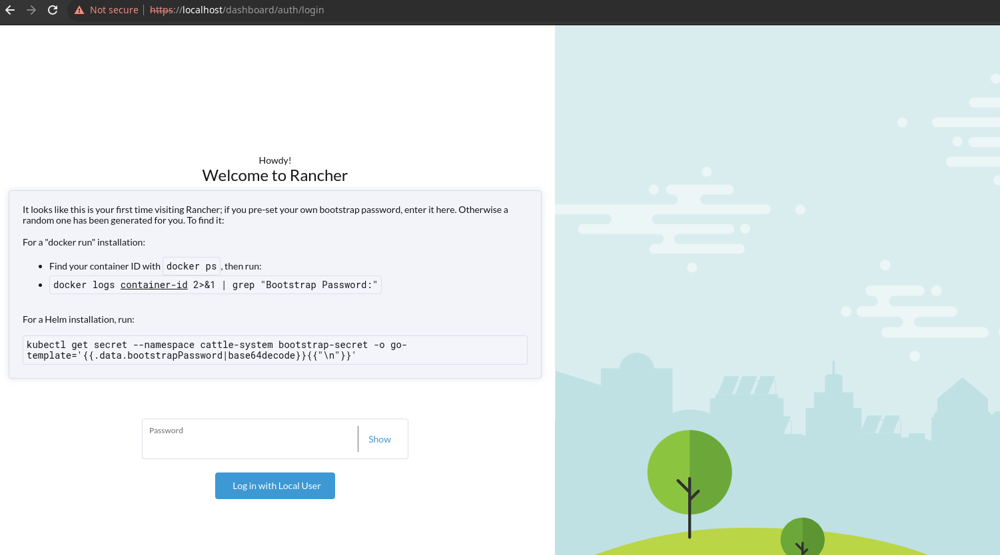
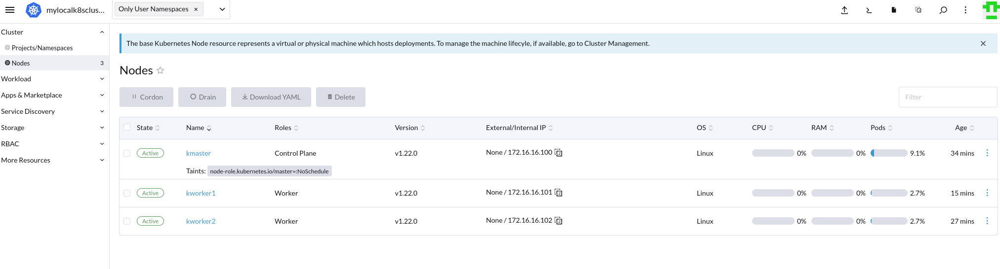

# Rancher with Kubernetes


## kubernetes cluster setup
```
$ vagrant up
$ vagrant status
Current machine states:

kmaster                   running (virtualbox)
kworker1                  running (virtualbox)
kworker2                  running (virtualbox)

$ scp root@kmaster.example.com:/etc/kubernetes/admin.conf ~/.kube/config

$ kubectl get nodes   
NAME       STATUS   ROLES                  AGE     VERSION
kmaster    Ready    control-plane,master   6h1m    v1.22.0
kworker1   Ready    <none>                 5h57m   v1.22.0
kworker2   Ready    <none>                 5h57m   v1.22.0

** if it does not show like above, you need to check the bootstrap.sh, bootstrap_kmaster.sh, bootstrap_kworker.sh and run manually. **

```

## before running the rancher docker on arch linux
When run docker command for rancher/rancher image, I got some error like this.
```
E0927 22:36:42.258152       1 node_container_manager_linux.go:60] "Failed to create cgroup" err="cannot enter cgroupv2 \"/sys/fs/cgroup/kubepods\" with domain controllers -- it is in an invalid state" cgroupName=[kubepods]
E0927 22:36:42.258178       1 kubelet.go:1423] "Failed to start ContainerManager" err="cannot enter cgroupv2 \"/sys/fs/cgroup/kubepods\" with domain controllers -- it is in an invalid state"
W0927 22:36:42.258172       1 watcher.go:95] Error while processing event ("/sys/fs/cgroup/kubepods": 0x40000100 == IN_CREATE|IN_ISDIR): inotify_add_watch /sys/fs/cgroup/kubepods: no such file or directory

```
In order to fix I need to do following the steps below:

```
$ sudo vim /etc/default/grub
$ add `systemd.unified_cgroup_hierarchy=0` to `GRUB_CMDLINE_LINUX_DEFAULT`
$ run `grub-mkconfig -o /boot/grub/grub.cfg`
Then restart the machine
```

## rancher setup
```
$ sudo docker run -d --restart=unless-stopped -p 80:80 -p 443:443 -v /opt/rancher:/var/lib/rancher --privileged rancher/rancher

```
After it started successfully you will see this screen:



follow the step to login.

Then import my existing kubernetes cluster in to Rancher as below:

