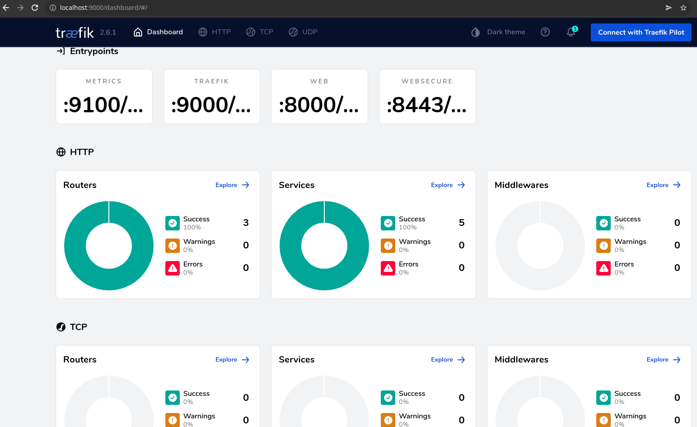

# Traefik with Kubernetes

## components
* Kubernetes
* Traefik
* MetalLB
* Vagrant - VirtualBox
* nfs server
* Ubuntu 20.04 
* Containerd
* Helm

## kubernetes cluster setup
```
$ vagrant up
$ vagrant status
Current machine states:

kmaster                   running (virtualbox)
kworker1                  running (virtualbox)
kworker2                  running (virtualbox)

$ scp root@kmaster.example.com:/etc/kubernetes/admin.conf ~/.kube/config

$ get nodes -o wide
NAME       STATUS   ROLES                  AGE   VERSION   INTERNAL-IP     EXTERNAL-IP   OS-IMAGE             KERNEL-VERSION     CONTAINER-RUNTIME
kmaster    Ready    control-plane,master   59m   v1.22.0   172.16.16.100   <none>        Ubuntu 20.04.2 LTS   5.4.0-77-generic   containerd://1.5.5
kworker1   Ready    <none>                 57m   v1.22.0   172.16.16.101   <none>        Ubuntu 20.04.2 LTS   5.4.0-77-generic   containerd://1.5.5
kworker2   Ready    <none>                 91s   v1.22.0   172.16.16.102   <none>        Ubuntu 20.04.2 LTS   5.4.0-77-generic   containerd://1.5.5

** if it does not show like above, you need to check the bootstrap.sh, bootstrap_kmaster.sh, bootstrap_kworker.sh and run manually. **

```

## metallb setup
```
$ kubectl apply -f https://raw.githubusercontent.com/metallb/metallb/v0.12.1/manifests/namespace.yaml
$ kubectl apply -f https://raw.githubusercontent.com/metallb/metallb/v0.12.1/manifests/metallb.yaml

$ vim metallb.yaml 

apiVersion: v1
kind: ConfigMap
metadata:
  namespace: metallb-system
  name: config
data:
  config: |
    address-pools:
    - name: default
      protocol: layer2
      addresses:
      - 172.16.16.240-172.16.16.250

$ kubectl apply -f metallb.yaml

$ kubectl create deploy nginx --image nginx

$ kubectl expose deploy nginx --port 80 --type LoadBalancer

$ kubectl get svc
NAME         TYPE           CLUSTER-IP      EXTERNAL-IP     PORT(S)        AGE
kubernetes   ClusterIP      10.96.0.1       <none>          443/TCP        116m
nginx        LoadBalancer   10.108.55.173   172.16.16.240   80:31329/TCP   2m9s

$ curl 172.16.16.240

```

## nfs setup on host machine
```
$ sudo pacman -S nfs-utils
$ sudo mkdir -p /srv/nfs/kubedata
$ sudo chown nobody: /srv/nfs/kubedata
$ sudo vim /etc/exports
add line below:
/srv/nfs/kubedata	*(rw,sync,no_subtree_check,no_root_squash,no_all_squash,insecure)
$ sudo systemctl enable --now nfs-server
$ sudo exportfs -rav                    
exporting *:/srv/nfs/kubedata
$ sudo showmount -e localhost           
Export list for localhost:
/srv/nfs/kubedata *

test mounting from kubernetes worker nodes
$ vagrant ssh kworker2
root@kworker1:~# apt install nfs-common
root@kworker1:~# mount -t nfs 192.168.1.44:/srv/nfs/kubedata /mnt
root@kworker1:~# mount | grep kubedata
192.168.1.44:/srv/nfs/kubedata on /mnt type nfs4 (rw,relatime,vers=4.2,rsize=1048576,wsize=1048576,namlen=255,hard,proto=tcp,timeo=600,retrans=2,sec=sys,clientaddr=10.0.2.15,local_lock=none,addr=192.168.1.44)
root@kworker1:~# umount /mnt
```

## provision the Storage Class, PV, PVC
```
$ cd nfs-provisioner
$ kubectl apply -f rbac.yaml
$ kubectl apply -f class.yaml
$ kubectl apply -f deployment.yaml

$ kubectl get pods                
NAME                                      READY   STATUS    RESTARTS   AGE
nfs-client-provisioner-7c98fb5db4-qs8ck   1/1     Running   0          43s

$ kubectl get sc  
NAME         PROVISIONER                                   RECLAIMPOLICY   VOLUMEBINDINGMODE   ALLOWVOLUMEEXPANSION   AGE
nfs-client   k8s-sigs.io/nfs-subdir-external-provisioner   Delete          Immediate           false                  9m3s

$ kubectl get pv,pvc        
NAME                                                        CAPACITY   ACCESS MODES   RECLAIM POLICY   STATUS   CLAIM                 STORAGECLASS   REASON   AGE
persistentvolume/pvc-a8dc5205-9af8-438d-9294-692dfc75d8a4   500Mi      RWX            Delete           Bound    default/pvc-nfs-pv1   nfs-client              3s

NAME                                STATUS   VOLUME                                     CAPACITY   ACCESS MODES   STORAGECLASS   AGE
persistentvolumeclaim/pvc-nfs-pv1   Bound    pvc-a8dc5205-9af8-438d-9294-692dfc75d8a4   500Mi      RWX            nfs-client     3s

$ ls /srv/nfs/kubedata                                
default-pvc-nfs-pv1-pvc-a8dc5205-9af8-438d-9294-692dfc75d8a4
```

### helm instlal
```
$ curl -fsSL -o get_helm.sh https://raw.githubusercontent.com/helm/helm/main/scripts/get-helm-3
$ chmod 700 get_helm.sh
$ ./get_helm.sh
```

## traefik setup
```
$ helm repo add traefik https://helm.traefik.io/traefik
$ helm repo update
$ helm repo list  
NAME   	URL                            
traefik	https://helm.traefik.io/traefik
$ helm search repo traefik
NAME           	CHART VERSION	APP VERSION	DESCRIPTION                                  
traefik/traefik	10.14.2      	2.6.1      	A Traefik based Kubernetes ingress controller
$ helm show values traefik/traefik > traefik-values.yaml
$ vim traefik-values.yaml

persistence:
  enabled: true <-- change this
  name: data
#  existingClaim: ""
  accessMode: ReadWriteOnce
  size: 128Mi
  storageClass: "nfs-client" <-- change this
  path: /data
  annotations: {}

$ helm install traefik traefik/traefik --values traefik-values.yaml -n traefik --create-namespace

$ kubectl get pods -n traefik     
NAME                       READY   STATUS    RESTARTS   AGE
traefik-7c9f8c458f-xbg5t   1/1     Running   0          4m49s

$ kubectl port-forward -n traefik traefik-7c9f8c458f-xbg5t 9000:9000

```
open browser at http://localhost:9000/dashboard/#/ you will see the below screen:



## deploy ingress routes
```
$ cd ingress
$ kubectl create -f nginx-deploy-main.yaml -f nginx-deploy-blue.yaml -f nginx-deploy-green.yaml
$ kubectl expose deploy nginx-deploy-main --port 80
$ kubectl expose deploy nginx-deploy-blue --port 80
$ kubectl expose deploy nginx-deploy-green --port 80

$ kubectl create -f 1-ingressroutes.yaml
$ kubectl -n traefik get svc
NAME      TYPE           CLUSTER-IP       EXTERNAL-IP     PORT(S)                      AGE
traefik   LoadBalancer   10.105.194.226   172.16.16.240   80:30321/TCP,443:31689/TCP   12h

$ vim /etc/hosts

172.16.16.240   nginx.example.com

$ kubectl get ingressroutes             
NAME    AGE
nginx   10s

$ kubectl delete ingressroutes nginx
$ kubectl create -f 3-ingressroutes.yaml

$ vim /etc/hosts

172.16.16.240   nginx.example.com blue.nginx.example.com green.nginx.example.com


```

## references
* https://github.com/kubernetes-sigs/nfs-subdir-external-provisioner
* https://doc.traefik.io/traefik/
* 