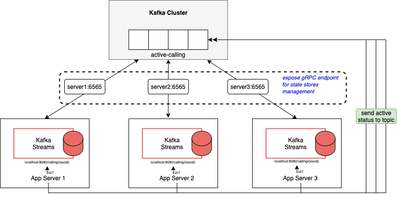

# Kafka Streams + Spring + gRPC

### architecture



### build project
```shell
$ mvn compile
$ mvn clean isntall -DskipTests
```

### start spring boot
```shell
$ SERVER_PORT=8080 GRPC_PORT=6565 java -Dspring.profiles.active=app1 -jar target/active-calling-app-0.0.1-SNAPSHOT.jar 
$ SERVER_PORT=8081 GRPC_PORT=6566 java -Dspring.profiles.active=app2 -jar target/active-calling-app-0.0.1-SNAPSHOT.jar 
```

### update active calling by send to `active-calling` topic
```shell
$ bin/kafka-console-producer.sh --broker-list localhost:9092 --topic active-calling --property "parse.key=true" --property "key.separator=:"
>200:false
>100:true
```

### endpoints
* http://localhost:8080/calling/{ssoid}
* http://localhost:8081/calling/{ssoid}

### interactive result by get active calling by ssoid for instance 1
```shell
$ while true; do                                                                                                                          
curl -w "\n" http://localhost:8080/calling/200
sleep 1
done
```

### interactive result by get active calling by ssoid for instance 2
```shell
$ while true; do                                                                                                                          
curl -w "\n" http://localhost:8081/calling/200
sleep 1
done
```

### Reference
https://docs.confluent.io/platform/current/streams/developer-guide/interactive-queries.html