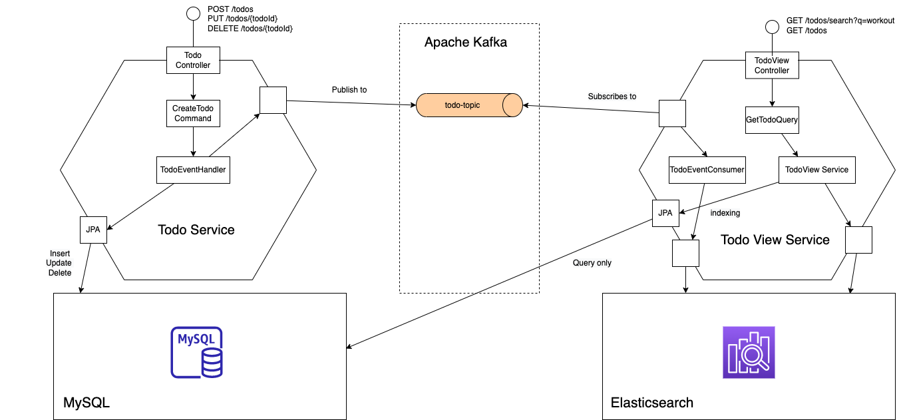

# Todo list architecture
The Todo List application is built using

- Java
- JPA
- Axon Framework
- Spring Boot
- MySQL
- ElasticSearch
- Apache Kafka

## diagram



## docker for axonserver, elasticsearch and kibana
```
$ docker run -d --name axonserver -p 8024:8024 -p 8124:8124 axoniq/axonserver

$ docker run -d --name my-es --net es-network -p 9200:9200 -p 9300:9300 -e "discovery.type=single-node" elasticsearch:7.17.1

$ docker run -d --name my-kib01 --net es-network -p 127.0.0.1:5601:5601 -e "ELASTICSEARCH_HOSTS=http://my-es:9200" docker.elastic.co/kibana/kibana:7.17.1
```

## testing command
```
$ curl -XPOST 'http://localhost:8081/todos' \
-H 'Content-Type: application/json' \
-d '{
    "title": "workout",
    "completed": 0,
    "order": 100
}'

```

## testing query
```
$ curl -XGET 'http://localhost:8082/todos/search?q=workout'
[{"id":"j1Sh6X8BFCPwvILV7yun","title":"workout","completed":false,"executionOrder":100}]
```

### search in elasticsearch
```
$ curl -XPOST "http://localhost:9200/_search" -H "Content-Type: application/json" -d'
  {
     "query": {
       "match_all": {}
     }
  }'
```

### add more todos
```
$ curl -XPOST 'http://localhost:8081/todos' \
-H 'Content-Type: application/json' \
-d '{
    "title": "watch tv",
    "completed": 0,
    "order": 100
}'

$ curl -XPOST 'http://localhost:8081/todos' \
-H 'Content-Type: application/json' \
-d '{
    "title": "watch series",
    "completed": 0,
    "order": 100
}'

```

## using todo view api
```
$ curl -XGET 'http://localhost:8082/todos/search?q=watch' | jq
[
  {
    "todoId": "d7270171-12e2-44bc-9ba9-094845e5d28e",
    "title": "watch movies",
    "completed": false,
    "executionOrder": 100
  },
  {
    "todoId": "40e472d1-0793-4d21-af1c-4b09951e540f",
    "title": "watch tv",
    "completed": false,
    "executionOrder": 100
  },
  {
    "todoId": "d3d07f99-352b-4d5a-b9f0-0d1345d162f8",
    "title": "watch series",
    "completed": false,
    "executionOrder": 100
  }

```

### get all todos
```
$ curl -XGET 'http://localhost:8082/todos'

```