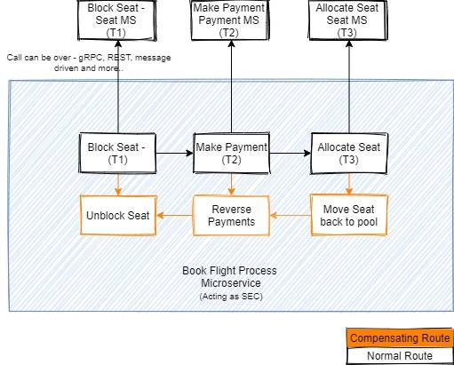

# book flight saga orchestration

The implementation will be using:
- spring boot
- Eventuate Tram Sagas

## diagram

## reference
* https://developer.ibm.com/articles/use-saga-to-solve-distributed-transaction-management-problems-in-a-microservices-architecture/
* https://eventuate.io/docs/manual/eventuate-tram/latest/getting-started-eventuate-tram-sagas.html